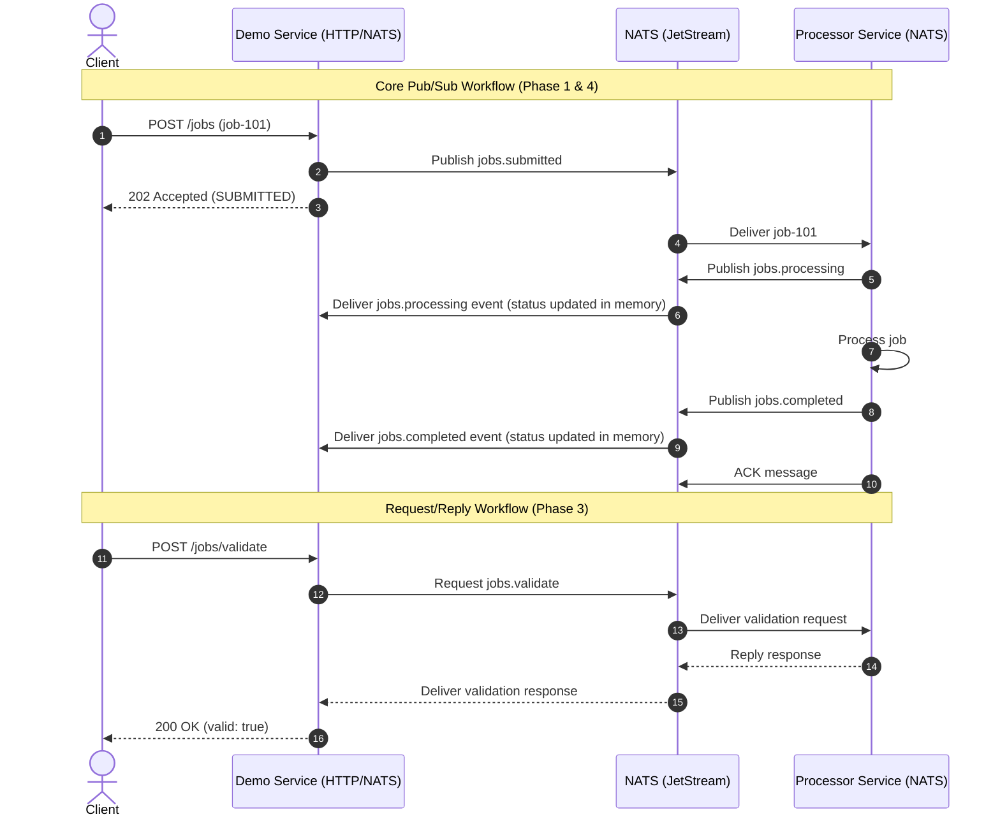

# NATS Platform Demo - API Specification

This document details the HTTP endpoints and NATS subject/message contracts for the **NATS Platform Demo**. The system consists of two services:
1. **Demo Service**: Exposes an HTTP API for job submission, validation, status checks, and replay triggers.
2. **Processor Service**: Consumes jobs, validates requests, processes jobs (with redelivery/deduplication support), and publishes lifecycle events.

---

## 1. HTTP API (Demo Service)

All endpoints below are served by the **Demo Service** (defaulting to `http://localhost:8080`).

### 1.1. Submit Job
Submit a job for processing. This is a **fire-and-forget** operation. The Demo Service publishes a NATS message and immediately returns `202 Accepted`.

* **Endpoint**: `POST /jobs`
* **Content-Type**: `application/json`
* **Request Headers**:
  * `X-Correlation-Id`: (Optional) A unique string for tracing. If not provided, the Demo Service will generate one.
* **Request Body**:
  ```json
  {
    "job_id": "job-101",
    "type": "image-processing",
    "payload": {
      "file": "image-101.jpg",
      "simulate_failure": false,
      "simulate_failure_count": 0
    }
  }
  ```
  *(Note: `simulate_failure` and `simulate_failure_count` can be passed in the payload to test NACKs and redeliveries in Phase 7).*
* **Response**: `202 Accepted`
* **Response Body**:
  ```json
  {
    "job_id": "job-101",
    "status": "SUBMITTED",
    "correlation_id": "8f32a1c2"
  }
  ```
* **NATS Action**: Publishes message to subject `jobs.submitted`.

---

### 1.2. Validate Job
Synchronously validates a job configuration using NATS **Request/Reply**. The Demo Service blocks waiting for the Processor Service's response.

* **Endpoint**: `POST /jobs/validate`
* **Content-Type**: `application/json`
* **Request Body**:
  ```json
  {
    "job_id": "job-101",
    "type": "image-processing",
    "payload": {
      "file": "image-101.jpg"
    }
  }
  ```
* **Response**: `200 OK`
* **Response Body**:
  ```json
  {
    "valid": true,
    "message": "Job configuration is valid."
  }
  ```
* **NATS Action**: Sends a request to subject `jobs.validate` with a timeout (e.g., 2 seconds) and returns the reply.

---

### 1.3. Get Job Status
Retrieve the status of a specific job. Initially, this status is tracked in-memory by the Demo Service by listening to NATS lifecycle events.

* **Endpoint**: `GET /jobs/{job_id}`
* **Response**: `200 OK` (if found) or `404 Not Found`
* **Response Body**:
  ```json
  {
    "job_id": "job-101",
    "status": "COMPLETED",
    "delivery_count": 1,
    "correlation_id": "8f32a1c2",
    "history": [
      {
        "status": "SUBMITTED",
        "timestamp": "2026-08-31T12:00:00Z"
      },
      {
        "status": "PROCESSING",
        "timestamp": "2026-08-31T12:00:01Z"
      },
      {
        "status": "COMPLETED",
        "timestamp": "2026-08-31T12:00:03Z"
      }
    ]
  }
  ```

---

### 1.4. List Jobs
List all jobs currently stored in the Demo Service's in-memory store. Essential for observing overall progress during a demo.

* **Endpoint**: `GET /jobs`
* **Response**: `200 OK`
* **Response Body**:
  ```json
  [
    {
      "job_id": "job-101",
      "status": "COMPLETED",
      "delivery_count": 1
    },
    {
      "job_id": "job-102",
      "status": "PROCESSING",
      "delivery_count": 2
    }
  ]
  ```

---

### 1.5. Replay Jobs
Trigger a JetStream replay. The Demo Service creates an ephemeral replay consumer to replay historical events from the stream.

* **Endpoint**: `POST /jobs/replay`
* **Content-Type**: `application/json`
* **Request Body** (Option A: Sequence-based):
  ```json
  {
    "from_sequence": 100,
    "to_sequence": 120
  }
  ```
  *(or Option B: Time-based)*:
  ```json
  {
    "from_time": "2026-08-31T10:00:00Z",
    "to_time": "2026-08-31T11:00:00Z"
  }
  ```
* **Response**: `202 Accepted`
* **Response Body**:
  ```json
  {
    "status": "REPLAY_STARTED",
    "consumer": "job-replay-001"
  }
  ```

---

### 1.6. Get Subscriptions
Retrieve the active subscriptions configured for demonstrating NATS subject addressing.

* **Endpoint**: `GET /messaging/subscriptions`
* **Response**: `200 OK`
* **Response Body**:
  ```json
  {
    "subscriptions": [
      {
        "name": "exact",
        "subject": "jobs.submitted"
      },
      {
        "name": "single-level",
        "subject": "jobs.*"
      },
      {
        "name": "multi-level",
        "subject": "jobs.>"
      }
    ]
  }
  ```

---

### 1.7. Get Addressing Activity
Retrieve the observed routing activity displaying which subscriptions received each message.

* **Endpoint**: `GET /messaging/activity`
* **Response**: `200 OK`
* **Response Body**:
  ```json
  {
    "events": [
      {
        "subject": "jobs.submitted",
        "received_by": [
          "exact",
          "single-level",
          "multi-level"
        ],
        "timestamp": "2026-08-31T10:30:00Z"
      },
      {
        "subject": "jobs.processing.started",
        "received_by": [
          "multi-level"
        ],
        "timestamp": "2026-08-31T10:30:01Z"
      }
    ]
  }
  ```

---

## 2. NATS Subjects & Payload Contracts

All NATS message payloads are structured as JSON. Standard metadata is passed via NATS headers to keep the payload clean.

### 2.1. Headers
The following headers must be present in messages:
* `Content-Type`: `application/json`
* `Nats-Msg-Id`: Unique message ID (used for JetStream message deduplication).
* `X-Correlation-Id`: Correlation ID passed down from the client.
* `X-Source`: Identifier of the sending service (e.g., `demo-service` or `processor-service`).

---

### 2.2. NATS Contracts

| Subject | Direction | Purpose | Payload Schema |
| :--- | :--- | :--- | :--- |
| `jobs.submitted` | Demo -> Processor | Job submission event | `{"job_id": string, "type": string, "payload": object}` |
| `jobs.validate` | Demo <-> Processor | Req/Rep validation | **Req**: `{"job_id": string, "type": string, "payload": object}`<br>**Rep**: `{"valid": boolean, "message": string}` |
| `jobs.processing.started` | Processor -> Demo | Job processing started | `{"job_id": string, "status": "PROCESSING", "delivery_count": int}` |
| `jobs.processing.completed` | Processor -> Demo | Processing completed successfully | `{"job_id": string, "status": "COMPLETED", "delivery_count": int}` |
| `jobs.processing.failed` | Processor -> Demo | Processing failed | `{"job_id": string, "status": "FAILED", "delivery_count": int, "error": string}` |
| `jobs.completed` | Processor -> Demo | Job successfully finished | `{"job_id": string, "status": "COMPLETED", "delivery_count": int}` |
| `jobs.failed` | Processor -> Demo | Job execution failed | `{"job_id": string, "status": "FAILED", "delivery_count": int, "error": string}` |

---

## 3. Workflow Flowchart



---

## 4. Proposed Phased Approach

We recommend building the services incrementally across the following stages:

1. **Phase 1 (Core)**:
   * Implement basic folder structure, `go.mod`, configurations.
   * `POST /jobs` endpoint publishing to Core NATS `jobs.submitted`.
   * Processor subscribing to `jobs.submitted` with simple logging.
2. **Phase 2 (Lifecycle & Status)**:
   * Processor publishing lifecycle events (`jobs.processing`, `jobs.completed`, `jobs.failed`).
   * Demo service subscribing to wildcard `jobs.*` to track in-memory state.
   * `GET /jobs` and `GET /jobs/{job_id}` endpoints.
3. **Phase 3 (Request/Reply)**:
   * `POST /jobs/validate` HTTP handler on Demo Service.
   * Sync NATS `jobs.validate` handler on Processor Service.
4. **Phase 4 (JetStream & Durability)**:
   * Setup JetStream stream `JOBS` listening to `jobs.>`.
   * Migrate processor consumer to a Pull-based Durable JetStream consumer.
5. **Phase 5 (Advanced capabilities)**:
   * Competing consumers, delivery semantics (ACK/NACK/redelivery count), and message deduplication.
   * Replay endpoint and custom consumer policies.
