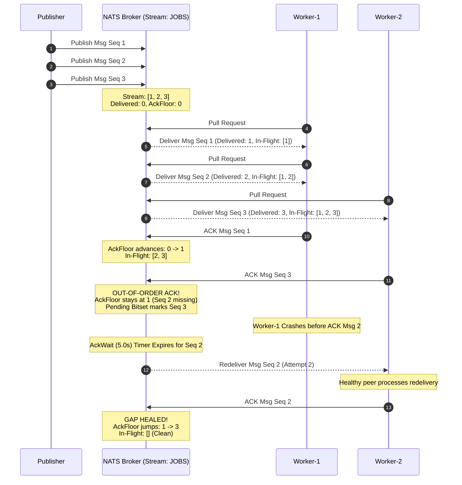
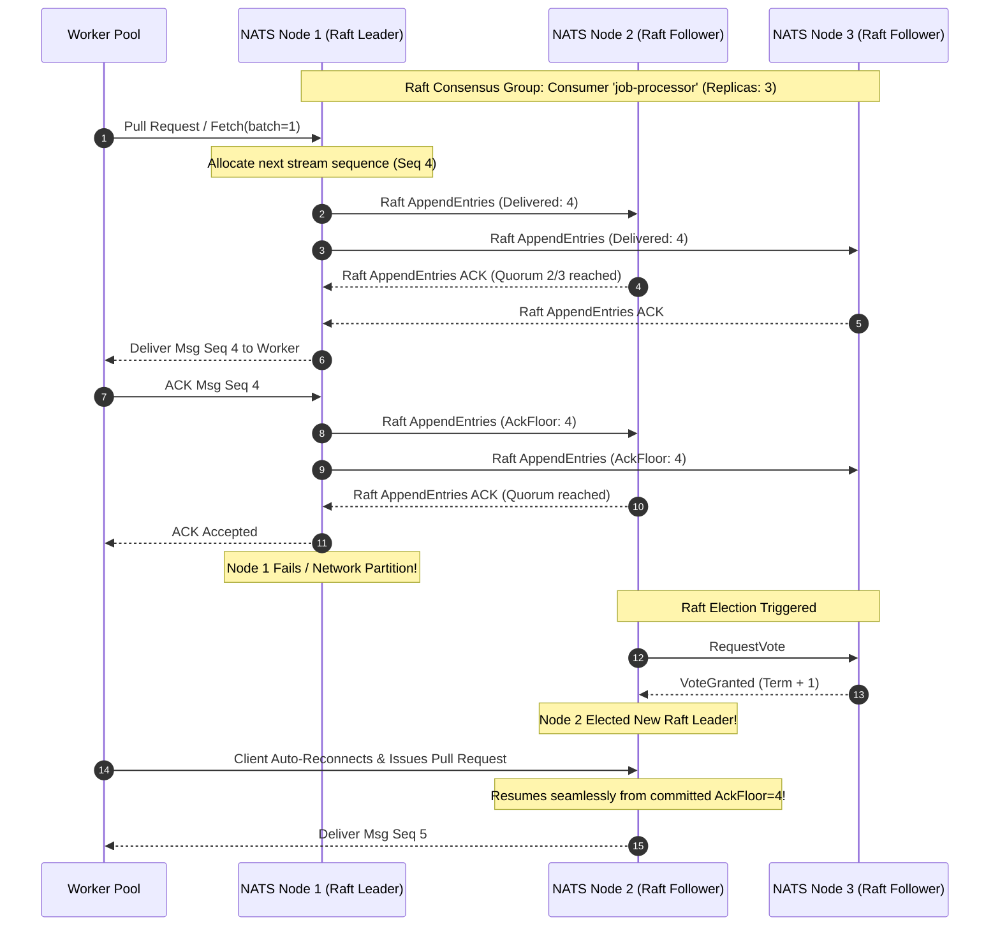

# NATS Platform Demo - Capability Evaluation Guide (NATS Demo View)

## 1. Objective and Scope

### 1.1 Purpose
The **NATS Demo View** provides a live, interactive evaluation environment to demonstrate and validate NATS platform capabilities using a local single-node NATS Server setup with JetStream enabled (`nats://localhost:4222`, file storage).

### 1.2 Evaluation Objectives
This demonstration evaluates four key platform architectural areas:
* **End-to-End Demo Flow**: Seamless ingestion and delivery through the complete data path: `Publisher (job-service:8081) -> JetStream (JOBS stream) -> Durable Consumer (job-processor) -> Worker Pool (processor-service:8082)`.
* **Consumer Contents & State Tracking**: Broker-managed state machines tracking `AckFloor` (contiguous sequence boundary), delivered sequence pointers, pending in-flight bitsets, and explicit acknowledgment semantics (`ACK`, `NAK`, `TERM`).
* **Unified View (SDK + CLI)**: Synchronized demonstrability combining real-time Go SDK runtime telemetry (logs, worker load distribution) with official `nats` CLI inspection views.
* **Multi-Worker Throughput Scaling**: Competing pull consumer elasticity scaling dynamically between 1 and 5 workers to demonstrate capacity-driven load distribution, zero-loss scale-in/scale-out without service restarts, and runtime failure resilience.

---

## 2. Architecture and Topology

*(Architecture diagram and system topology to be provided)*

---

## 3. Demonstrated NATS Capabilities

The following table summarizes the NATS platform capabilities demonstrated within this demo view:

| # | Capability Domain | NATS Feature / Mechanism | Demonstration Scope & Technical Behavior |
| :-: | :--- | :--- | :--- |
| **1** | **Ingestion & Routing** | Subject-Based Routing (`jobs.submitted`) | Publishers send structured JSON payloads routed to subject `jobs.submitted`. NATS delivers messages directly to bound streams. |
| **2** | **Message Envelope** | Key-Value Headers & Trace Context | Publishers attach arbitrary application metadata and W3C `traceparent` headers. NATS preserves and forwards all headers across the wire without payload mutation. |
| **3** | **Stream Persistence** | Persistent File Storage (`JOBS` Stream) | Messages commit directly to disk storage under stream `JOBS` with gapless sequential IDs (`Seq 1, 2, 3...`), surviving consumer detachment and broker restarts. |
| **4** | **Ingestion Deduplication** | Sliding-Window Deduplication (`Nats-Msg-Id`) | Broker checks a 2-minute sliding deduplication cache. Duplicate IDs are suppressed from disk writes, returning a `PubAck(Duplicate=true)` and preventing duplicate downstream deliveries. |
| **5** | **Decoupled Buffering** | Broker-Side Queueing (Offline Consumer) | When worker pull loops are stopped (`OFF`), the broker safely buffers inbound messages on disk. Zero dropped messages; resuming workers drain the backlog in strict sequence. |
| **6** | **Durable Pull Consumer** | Shared Pull Consumer (`job-processor`) | Multiple worker goroutines pull from a single durable consumer tracking server-side cursors, using explicit acknowledgment (`AckExplicit`) and a 5-second `AckWait` threshold. |
| **7** | **Work Distribution** | Reactive Capacity Pull (Work-Stealing) | Workers pull work on demand via `Fetch()` rather than push round-robin. Fast workers naturally pull more work, eliminating head-of-line blocking under unequal processing times. |
| **8** | **Dynamic Scale-Out** | Elastic Worker Scaling (1W -> 3W / 5W) | Spawns additional competing worker goroutines under backlog without service restart or Kafka-style consumer group partition rebalance pauses (**Scenario 10**). |
| **9** | **Graceful Scale-In** | Orderly Worker Drain (3W -> 1W) | Retiring workers complete in-flight jobs and shut down cleanly from the tail. Unpulled stream backlog remains in the broker and routes to the remaining worker (**Scenario 9**). |
| **10** | **Crash Failover** | Timeout Redelivery (`AckWait` Expiry) | When a worker crashes midway before ACKing, the broker holds the message for 5s, then redelivers it (`Delivery: #2`) to an active healthy peer worker (**Scenario 7**). |
| **11** | **Slow Worker Racing** | Timeout Expiration with Late ACK | When worker processing exceeds 5s, the broker times out and redelivers to a peer. The peer completes at 6s; the original worker finishes at 7s and emits a safe late ACK (**Scenario 8**). |
| **12** | **Fast Negative ACK** | Immediate Retry via `msg.Nak()` | Worker explicitly rejects a transient failure. Broker bypasses the 5-second timeout countdown and immediately re-queues the message for instant redelivery. |
| **13** | **Poison Pill Isolation** | Terminal Termination via `msg.Term()` | Worker terminates corrupt or unprocessable payloads. Broker halts redelivery loops permanently and routes the message to Dead Letter handling. |

---

## 4. Live Demonstration Runbook

The live evaluation is organized into two practical demonstration parts: Single-Worker state & durability, followed by Multi-Worker concurrency & resilience.

### 4.1 Part A: Single-Worker Scenarios (State, Cursor & Durability)

| Step # | Capability Under Test | Operator Action | What NATS Does Under the Hood | Observable Confirmation |
| :---: | :--- | :--- | :--- | :--- |
| **1** | **Baseline Ingestion & Storage** | Click **Submit Job** in Stage 1. | Commits record to disk under `JOBS` stream; routes message to durable consumer `job-processor`. | Stage 1 shows accepted ID; Stage 2 increments message count; Stage 3 worker logs `[PULLED]` and `[ACK SENT]`. |
| **2** | **Server Deduplication** | Keep same `Nats-Msg-Id` and click **Submit Job** again. | Checks 2-minute sliding deduplication cache; detects duplicate ID; drops write; returns `PubAck(Duplicate=true)`. | Stage 2 message count does NOT increase; `job-service` logs `Status=DUPLICATE`; workers receive zero messages. |
| **3** | **Decoupled Ingestion & Buffering** | Toggle Worker Pull Loop to **OFF** in Stage 3, then click **Submit Job** 3 times. | Receives and stores all 3 messages on disk in `JOBS` stream; holds delivery because pull loop is idle. | Stage 2 stream messages increment by 3; Stage 3 shows 0 messages pulled; jobs remain buffered safely. |
| **4** | **Sequential Catch-up Drain** | Toggle Worker Pull Loop to **ON** in Stage 3. | Resumes pull loop; fetches unacknowledged messages sequentially starting from `AckFloor + 1`. | All 3 buffered jobs are pulled, processed, and acknowledged in sequence with zero message loss. |
| **5** | **Out-of-Order ACK & Hole Safety** | Set workers to **1W**, in Failure Lab click **Arm Out-of-Order**, then in Stage 1 click **Batch (3 Jobs)**. | Worker fetches 3-msg batch. Msg 1 ACKs (AckFloor advances). Msg 2 delays 10s (sending `msg.InProgress()` heartbeats). Msg 3 ACKs out-of-order; broker pins AckFloor at Msg 1 and marks Msg 3 in pending bitset. At 10s, Msg 2 ACKs and heals the gap; broker cascades AckFloor to Msg 3. | Stage 3 logs '[OUT-OF-ORDER ACK]' and '[GAP HEALED]'; Stage 3 Ack Floor badge and 'nats consumer info JOBS job-processor' show AckFloor pinned at 1 during 10s delay, then leaping to 3 once Msg 2 resolves. |

---

### 4.2 Part B: Multi-Worker Scenarios (Concurrency, Scaling & Resilience)

| Step # | Capability Under Test | Operator Action | What NATS Does Under the Hood | Observable Confirmation |
| :---: | :--- | :--- | :--- | :--- |
| **6** | **Demand Work Distribution** | Set workers to **3W**, click **Batch (6 Jobs)**. | Delivers messages reactively based on worker pull requests; fast workers pull more work naturally. | Terminal logs show load distributed across `processor-1`, `processor-2`, and `processor-3` concurrently. |
| **7** | **Dynamic Scale-Out (Scenario 10)** | Set workers to **1W**, toggle pull loop **OFF**, click **Batch (6 Jobs)**, switch to **3W**, toggle pull loop **ON**. | Spawns new worker goroutines that immediately join the shared pull consumer without repartitioning pauses. | Backlog drains 3x faster; load distributed across all 3 workers with zero duplicate deliveries. |
| **8** | **Dynamic Scale-In (Scenario 9)** | Set workers to **3W**, click **Batch (6 Jobs)**, then immediately click **1W**. | Retiring workers finish in-flight jobs and shut down; unpulled jobs remain in stream and route to remaining worker. | Workers 2 and 3 stop gracefully; worker 1 completes all remaining jobs without dropped messages. |
| **9** | **Worker Crash Failover (Scenario 7)** | Set workers to **3W**, expand **Failure Lab**, click **Arm Crash**, then click **Submit Job**. | Holds unacknowledged message during 5s `AckWait`; on timeout, redelivers message to healthy surviving peer. | `processor-1` panics (`DEGRADED: 2/3 active`); surviving workers continue; peer receives redelivery and ACKs; supervisor revives worker. |
| **10** | **Slow Worker Timeout (Scenario 8)** | Set workers to **2W**, click **Arm Exceed (7s)**, click **Submit Job**, then click **Submit Job** again. | At `T = 5s`, marks unacknowledged message for redelivery to healthy peer while second job processes concurrently. | `processor-1` holds job for 7s; `processor-2` processes job 2 immediately, then receives redelivered job 1 at `T = 5s` and ACKs at `T = 6s`. |
| **11** | **Fast Retry via NAK** | In Failure Lab, click **Arm NAK**, then click **Submit Job**. | Receives `msg.Nak()`, skips the 5s timeout countdown, and immediately places message back in pull queue. | Message redelivered instantly on Attempt #2 without waiting 5s; terminal confirms immediate re-pull. |
| **12** | **Poison Pill Termination (TERM)** | In Failure Lab, click **Arm Term**, then click **Submit Job**. | Receives `msg.Term()`, immediately removes message from active delivery schedule, preventing retry storms. | Worker logs poison message termination; stream remains healthy and stable; no endless retry loop. |

---

## 5. Internal Mechanisms & Sequence Diagrams

### 5.1 Coordination of Delivered Seq, AckFloor, and In-Flight Messages

* **Applicable Setup & State**: Any pull consumer workload where messages are processed concurrently or out-of-order by one or more workers.
* **Applicable Demo Scenarios**:
  * **Scenario 5 (Out-of-Order ACKs)**: Proves why `AckFloor` cannot skip unacknowledged gaps.
  * **Scenario 7 (Worker Crash Before ACK)**: Proves what happens when the worker holding the missing message dies, triggering the 5s `AckWait` countdown and failover to a healthy peer.

#### Key Architectural Rules:
1. **Contiguous Safety (`AckFloor`)**: The `AckFloor` never skips unacknowledged sequences. If sequence 2 is missing, `AckFloor` stays at 1 even if sequence 3 is acknowledged.
2. **In-Flight Bitset Tracking**: Out-of-order ACKs (like sequence 3) are recorded in an internal pending bitset so they are not re-processed once sequence 2 resolves.
3. **Automatic Gap Healing**: The moment sequence 2 is redelivered and acknowledged by any worker, the broker instantly cascades `AckFloor` up to the highest contiguous acknowledged sequence (jumping from 1 to 3).

---

### 5.2 Scaling Consumer Inside JetStream via Raft Consensus

* **Applicable Setup & State**: High-Availability Clustered NATS Deployments (multi-node NATS cluster, e.g., 3 nodes with `Replicas: 3`).
* **Applicable Demo Context**: In this local evaluation environment, NATS runs as a single-node broker (`Replicas: 1`). In production multi-node topologies, this Raft consensus architecture is the exact engine NATS uses to scale and replicate consumer state machines across cluster nodes with sub-second failover.

#### Key Architectural Rules:
1. **Raft-Replicated State Machine**: Each JetStream stream and consumer is managed by a dedicated **Raft Consensus Group**. Consumer state (`AckFloor`, sequence pointers, and redelivery counts) is synchronized across cluster members (typically R=3 or R=5).
2. **Leader-Coordinated Pulls**: One NATS node acts as the **Raft Leader** for `job-processor`. All worker pull requests and acknowledgments are handled by the leader and committed to the Raft log before being finalized.
3. **Zero-Downtime Failover**: If `NATS Node 1` crashes, `Node 2` or `Node 3` is elected as the new Raft leader within milliseconds (< 1s). The new leader already has the committed `AckFloor` and pending ACK state, ensuring zero state loss.
