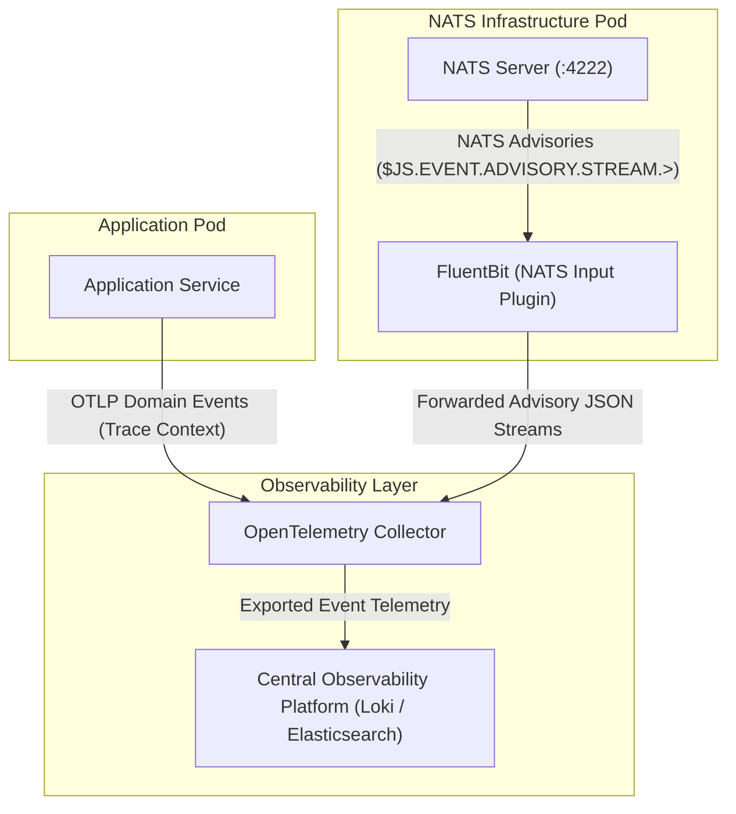

# NATS Event Observability & Advisory Guide

This guide details event observability across the NATS Infrastructure Layer and the Application Layer, outlining the significance of events in message-driven systems, telemetry flow via FluentBit log aggregators, and application handling of NATS JetStream advisories and domain events.

---

## 1. Overview of Events & Significance in Observability

In distributed event-driven systems, an **Event** represents a discrete, immutable record of a state change or operational lifecycle signal occurring at a specific point in time.

### Domain Events vs. NATS Advisory Events

- **Application Domain Events**: Business state changes emitted by application services (e.g. `order.created`, `payment.processed`). These events are carried as message payloads across NATS subjects or exported directly as structured OTLP event records.
- **NATS Advisory Events**: Operational lifecycle signals emitted automatically by NATS Server on reserved system subjects (`$SYS.>` and `$JS.EVENT.ADVISORY.>`). These advisories inform operators and log aggregators about cluster state changes, stream replication events, consumer backpressure, and resource limits.

### NATS JetStream Advisory Categories

NATS Server publishes structured JSON advisory payloads across standardized system subject hierarchies:

| System Subject Pattern | Advisory Purpose | Observability Value |
|---|---|---|
| `$JS.EVENT.ADVISORY.STREAM.CREATED.>` | Stream creation notifications. | Tracks stream lifecycle and configuration changes. |
| `$JS.EVENT.ADVISORY.STREAM.QUORUM_LOST.>` | Stream leader or quorum loss notifications. | Alerts on cluster partition or storage node degradation. |
| `$JS.EVENT.ADVISORY.CONSUMER.PAUSED.>` | Consumer pause and resume state changes. | Explains sudden delivery pauses during consumer maintenance. |
| `$SYS.ACCOUNT.*.CONNECT` / `DISCONNECT` | Client connection and disconnect events. | Tracks client connection churn and network instability. |

---

## 2. Telemetry Flow Diagram

The following diagram illustrates how NATS Server advisory events and Application domain events flow from infrastructure pods through log aggregators and OpenTelemetry Collectors to the central observability platform.



### FluentBit NATS Advisory Ingestion Configuration (`fluent-bit.conf`)

FluentBit uses a native `nats` input plugin to subscribe directly to NATS Server system subjects on port `4222`, ingesting JetStream stream advisories without requiring application intervention. For full plugin options and parameters, see the [Fluent Bit NATS Input Plugin Documentation](https://docs.fluentbit.io/manual/pipeline/inputs/nats).

```ini
[SERVICE]
    Flush        1
    Log_Level    info

[INPUT]
    Name         nats
    Host         nats-1
    Port         4222
    Subscribe    $JS.EVENT.ADVISORY.STREAM.>
    Tag          nats.advisories

[OUTPUT]
    Name         loki
    Match        nats.advisories
    Host         otel-lgtm
    Port         3100
    Labels       job=nats-stream-advisories
```

---

## 3. Application Code Guide: Advisory Ingestion & Domain Event Publishing

Applications interact with events in two ways:
1. **Consuming NATS Advisories**: Listening to `$JS.EVENT.ADVISORY.>` system subjects to dynamically react to stream state changes, consumer pause events, or delivery failures.
2. **Emitting Domain Events**: Publishing business state events with injected OpenTelemetry context (`trace_id`, `span_id`) so that event processing cascades can be traced end-to-end.

### Conceptual Workflow

1. **Advisory Subscription**: Connect to NATS using credentials with permission to subscribe to `$JS.EVENT.ADVISORY.>` subjects.
2. **JSON Advisory Parsing**: Decode structured JSON payloads emitted by NATS Server to extract event metadata (`stream`, `consumer`, `error`, `timestamp`).
3. **Reactive Handling & Alerting**: Log decoded advisory attributes or trigger application backpressure adjustments.

### Prerequisites

1. Active NATS Server connection (`nats.Conn`) with read access to system subjects.
2. An OpenTelemetry Collector endpoint reachable for application OTLP telemetry.

### Implementation Examples

#### Go Implementation: Subscribing to NATS JetStream Advisories

The following example demonstrates how a Go service subscribes to NATS JetStream stream advisories (`$JS.EVENT.ADVISORY.STREAM.>`), parses structured JSON event payloads, and logs operational advisory signals:

```go
package main

import (
	"encoding/json"
	"log"

	"github.com/nats-io/nats.go"
)

// StreamAdvisoryPayload represents common NATS JetStream advisory event structures
type StreamAdvisoryPayload struct {
	Type     string `json:"type"`
	ID       string `json:"id"`
	Timestamp string `json:"timestamp"`
	Stream   string `json:"stream"`
	Subject  string `json:"subject,omitempty"`
}

func main() {
	nc, err := nats.Connect("nats://localhost:4222")
	if err != nil {
		log.Fatalf("Failed to connect to NATS: %v", err)
	}
	defer nc.Close()

	// Subscribe to all JetStream stream advisory events
	subject := "$JS.EVENT.ADVISORY.STREAM.>"
	_, err = nc.Subscribe(subject, func(msg *nats.Msg) {
		var advisory StreamAdvisoryPayload
		if err := json.Unmarshal(msg.Data, &advisory); err != nil {
			log.Printf("Failed to unmarshal advisory on %s: %v", msg.Subject, err)
			return
		}

		log.Printf("NATS Advisory Received [Subject=%s, Stream=%s, Type=%s]",
			msg.Subject, advisory.Stream, advisory.Type)
	})

	if err != nil {
		log.Fatalf("Failed to subscribe to advisories: %v", err)
	}

	log.Printf("Subscribed to NATS JetStream Advisories on %s", subject)
}
```
