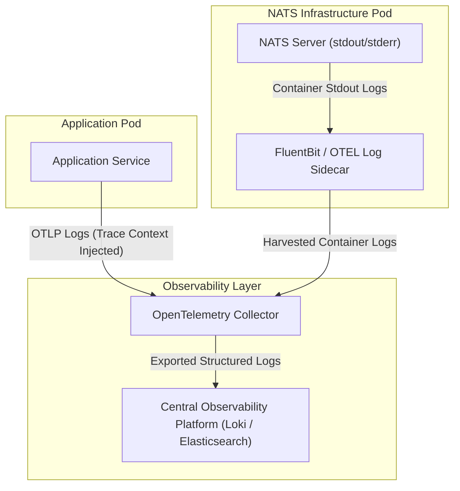

# NATS Logging Architecture & Strategy Guide

This guide details logging design and implementation across the NATS Infrastructure Layer and the Application Layer, outlining telemetry flow, OpenTelemetry application log instrumentation, and trace-to-log correlation using NATS Server protocol header tracing.

---

## 1. Overview of Logging

NATS Server emits structured logs directly to standard output (`stdout`) and standard error (`stderr`), following 12-Factor application principles. In containerized environments (such as Kubernetes), log aggregators (e.g. FluentBit or OpenTelemetry Collector `filelog` receiver running as a sidecar or DaemonSet) harvest container log streams and forward them to the central observability platform.

---

## 2. Telemetry Flow Diagram

The following diagram illustrates how both NATS Server logs and Application logs flow from infrastructure pods through log aggregators and OpenTelemetry Collectors to the central observability platform.



---

## 3. Application Code Guide: Structured Logging & Trace Context Injection

Application logs must be structured (JSON format) and include active OpenTelemetry trace context (`trace_id` and `span_id`) extracted from the active execution context. This allows every log line emitted during message processing to be directly correlated with active distributed trace spans in the central observability platform.

### Conceptual Workflow

1. **Context Extraction**: Inspect the active call context associated with the incoming or outgoing message execution.
2. **Trace ID Extraction**: Retrieve the current `trace_id` and `span_id` from the active OpenTelemetry span context.
3. **Structured Log Emission**: Append `trace_id` and `span_id` as top-level fields in all structured log records emitted to `stdout` or sent via OTLP.

### Prerequisites

1. An OpenTelemetry Collector is deployed and reachable via OTLP gRPC (`:4317`) or OTLP HTTP (`:4318`).
2. Application message handlers receive an active execution context containing an OpenTelemetry trace span (populated during NATS message publish or consume operations).

### Implementation Examples

#### Go Implementation (`slog` + OpenTelemetry Context)

The following example demonstrates how to implement a traced logger using the Go standard library `log/slog` that automatically extracts `trace_id` and `span_id` from `context.Context` and appends them to log records:

```go
package logging

import (
	"context"
	"log/slog"
	"os"

	"go.opentelemetry.io/otel/trace"
)

// TracedLogger wraps slog.Logger to automatically append active OpenTelemetry trace metadata
type TracedLogger struct {
	logger *slog.Logger
}

// NewTracedLogger initializes a structured JSON logger writing to stdout or OTLP log pipeline
func NewTracedLogger() *TracedLogger {
	handler := slog.NewJSONHandler(os.Stdout, &slog.HandlerOptions{Level: slog.LevelInfo})
	return &TracedLogger{logger: slog.New(handler)}
}

func (l *TracedLogger) Info(ctx context.Context, msg string, attrs ...slog.Attr) {
	l.log(ctx, slog.LevelInfo, msg, attrs...)
}

func (l *TracedLogger) Error(ctx context.Context, msg string, attrs ...slog.Attr) {
	l.log(ctx, slog.LevelError, msg, attrs...)
}

func (l *TracedLogger) log(ctx context.Context, level slog.Level, msg string, attrs ...slog.Attr) {
	spanCtx := trace.SpanContextFromContext(ctx)
	if spanCtx.IsValid() {
		attrs = append(attrs,
			slog.String("trace_id", spanCtx.TraceID().String()),
			slog.String("span_id", spanCtx.SpanID().String()),
		)
	}
	l.logger.LogAttrs(ctx, level, msg, attrs...)
}
```

---

## 4. Establishing Correlation Between NATS Logs and Trace Context

### 4.1 Server Logging Configuration (`nats.conf`)

Basic NATS Server logging parameters can be configured in `nats.conf` to control timestamp formatting, log resolution, and debug levels:

```hocon
# Enable timestamps and microsecond UTC resolution
logtime: true
logtime_utc: true

# Debug logging (optional, default is false)
debug: false

# Protocol tracing (optional, default is false)
trace: false
```

---

### 4.2 NATS Server Protocol Tracing Mechanics

NATS Server is a high-performance, transparent message broker. By default, it does not inspect application payloads to log application `trace_id`s, preserving maximum throughput.

To correlate NATS Server logs directly with application trace context during incident triaging, enable NATS Server protocol header tracing. When enabled, NATS Server writes protocol headers—including standard W3C `traceparent` headers injected by OpenTelemetry SDKs—directly into server log streams.

#### Protocol Tracing Settings (`nats.conf`)

| Setting | Type | Meaning | Operational Impact |
|---|---|---|---|
| `trace` | boolean | Enable NATS protocol tracing (emits `PUB`, `SUB`, `MSG`, `HPUB`, `HMSG` frames). | Moderate log volume increase. |
| `trace_verbose` | boolean | Increase detail of protocol tracing (includes full message payloads). | High log volume and performance impact; avoid in production. |
| `trace_headers` | boolean | Include message headers (including `traceparent`) in protocol tracing logs. | Enables direct `trace_id` correlation in raw server logs. |

#### Full Server Tracing Configuration (`nats.conf`)

```hocon
# Enable protocol tracing with header inspection
trace: true
trace_verbose: false
trace_headers: true
```

#### Example NATS Server Trace Log Output

When `trace: true` and `trace_headers: true` are enabled, NATS Server emits log records containing the raw `traceparent` header:

```text
[104] 2026/09/28 16:05:00.123456 [TRC] 10.0.1.42:54321 - cid:42 - ->> HPUB orders.created 12 45
[104] 2026/09/28 16:05:00.123456 [TRC] 10.0.1.42:54321 - cid:42 - ->> traceparent: 00-4bf92f3577b34da6a3ce929d0e0e4736-00f067aa0ba902b7-01
```

#### Operational Best Practices & Dynamic Hot Reloading

- **Development & Staging Environments**: Enable `trace: true` and `trace_headers: true` to verify header propagation during integration testing.
- **Production Environments**: Keep protocol tracing disabled (`trace: false`) under normal operating conditions to preserve maximum performance.
- **On-Demand Production Triaging**: Toggle protocol tracing dynamically during active incident triage without restarting the NATS Server process:

```bash
# 1. Update nats.conf to set trace: true and trace_headers: true
# 2. Trigger hot reload via SIGHUP signal
nats-server --signal reload
```
