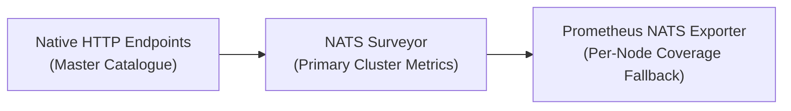
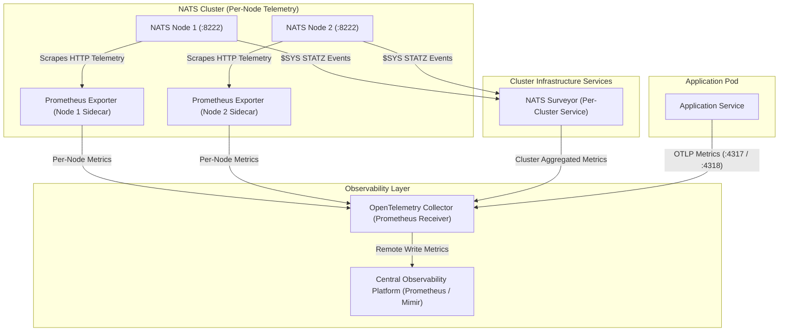

# NATS Metrics Architecture & Strategy Guide

This guide details metrics design and implementation across the NATS Infrastructure Layer and the Application Layer, outlining the enterprise metrics selection mental model, telemetry flow through OpenTelemetry Collectors, and application-level metrics instrumentation.

---

## 1. Overview of Metrics & Metrics Selection Strategy

In distributed NATS architectures, metrics provide real-time quantitative visibility into server health, cluster topology, JetStream storage limits, consumer backlog, and application message processing throughput.

### Enterprise Metrics Selection Mental Model

To determine the appropriate metrics source for a specific operational or business requirement, evaluate metrics using the three-tier decision hierarchy:



1. **NATS Surveyor (Primary Enterprise Source)**: NATS Surveyor is the primary cluster-level enterprise metrics aggregator. It subscribes to system events (`$SYS.REQ.SERVER.*.STATZ`) across all cluster nodes and exports unified cluster-wide metrics.
2. **Prometheus NATS Exporter (Per-Node / Coverage Fallback)**: Running as a per-node sidecar or daemon, the Prometheus NATS Exporter (`prometheus-nats-exporter`) scrapes individual server HTTP monitoring endpoints (`/varz`, `/connz`, `/routez`, `/subsz`, `/jsz`) on a per-instance basis to fill coverage gaps.
3. **Native HTTP Monitoring Endpoints (Master Catalogue)**: Native server HTTP endpoints represent the authoritative master catalogue of all raw telemetry produced by NATS Server. If neither Surveyor nor the Exporter exposes a required field, query native endpoints directly or evaluate custom exporter collection.

> **Operational Nuance**: Do not assume every raw field in native HTTP endpoints automatically exists 1:1 in the Exporter or Surveyor. Exporters select, transform, and aggregate native data. Always verify metric availability across tiers.

---

## 2. Telemetry Flow Diagram

The following diagram illustrates the topological distinction between **Per-Node Prometheus Exporters** (scraping individual NATS server nodes on port `:8222`) and the **Per-Cluster NATS Surveyor** (collecting system events across the cluster), routing all metrics alongside Application OTLP telemetry to the central observability platform.



---

## 3. Application Code Guide: OpenTelemetry Metrics Instrumentation

Application services instrument custom business and messaging metrics (such as message publish counts, consume throughput, processing latency, and handler errors) using OpenTelemetry Metrics SDKs.

### Conceptual Workflow

1. **Meter Initialization**: Obtain an OpenTelemetry `Meter` instance from the global `MeterProvider`.
2. **Instrument Registration**: Register metric instruments (Counters, UpDownCounters, Histograms) for messaging operations.
3. **Metric Recording**: Record values and execution durations alongside contextual attributes (`nats.subject`, `nats.stream`, `status`) during publish and consume operations.
4. **OTLP Export**: Push recorded metrics to the OpenTelemetry Collector via OTLP gRPC (`:4317`) or HTTP (`:4318`).

### Prerequisites

1. OpenTelemetry Collector is deployed and reachable via OTLP gRPC (`:4317`) or HTTP (`:4318`) with OTLP metrics enabled.
2. Application services initialize a global OpenTelemetry `MeterProvider` configured with an OTLP metric exporter.

### Implementation Examples

#### Go Implementation: OpenTelemetry Messaging Metrics

The following example demonstrates how to instrument custom NATS message publication and consumption metrics using the Go OpenTelemetry SDK:

```go
package metrics

import (
	"context"
	"time"

	"go.opentelemetry.io/otel"
	"go.opentelemetry.io/otel/attribute"
	"go.opentelemetry.io/otel/metric"
)

type NatsMetrics struct {
	publishCount   metric.Int64Counter
	processLatency metric.Float64Histogram
}

func NewNatsMetrics(serviceName string) (*NatsMetrics, error) {
	meter := otel.GetMeterProvider().Meter(serviceName)

	publishCount, err := meter.Int64Counter(
		"messaging.nats.published_messages",
		metric.WithDescription("Total number of messages published to NATS"),
		metric.WithUnit("{message}"),
	)
	if err != nil {
		return nil, err
	}

	processLatency, err := meter.Float64Histogram(
		"messaging.nats.processing_duration",
		metric.WithDescription("Duration of NATS message processing in seconds"),
		metric.WithUnit("s"),
	)
	if err != nil {
		return nil, err
	}

	return &NatsMetrics{
		publishCount:   publishCount,
		processLatency: processLatency,
	}, nil
}

func (m *NatsMetrics) RecordPublish(ctx context.Context, subject string) {
	m.publishCount.Add(ctx, 1, metric.WithAttributes(
		attribute.String("messaging.system", "nats"),
		attribute.String("messaging.destination", subject),
	))
}

func (m *NatsMetrics) RecordProcessing(ctx context.Context, subject, stream string, duration time.Duration) {
	m.processLatency.Record(ctx, duration.Seconds(), metric.WithAttributes(
		attribute.String("messaging.system", "nats"),
		attribute.String("messaging.destination", subject),
		attribute.String("messaging.stream", stream),
	))
}
```
