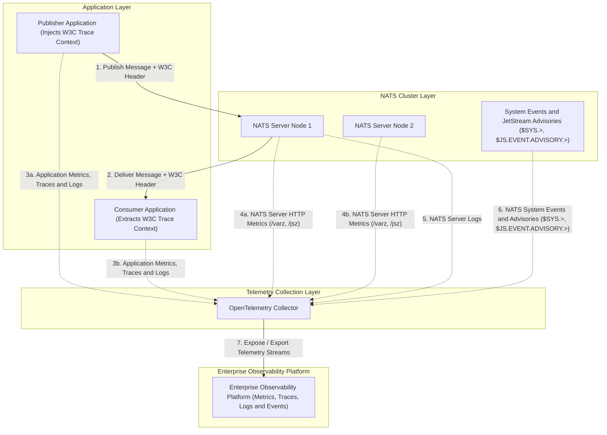

# NATS Observability Architecture Overview

This document defines what setting up observability in a NATS-based system entails across both the NATS Infrastructure Layer and the Application Layer.

---

## 1. Executive Intent & Scope

Observability in a NATS architecture requires collecting telemetry from two distinct layers:
1. **NATS Infrastructure Layer**: NATS Server nodes, JetStream storage engines, cluster routes, and consensus state.
2. **Application Layer**: Publisher services, consumer/worker services, and domain workflows.

Observability is organized across four telemetry pillars:
- **Metrics**: Quantitative operational indicators from server endpoints and application SDKs.
- **Traces**: Distributed trace propagation across asynchronous NATS message boundaries using W3C Trace Context.
- **Logs**: Structured logs from NATS server nodes and trace-correlated application logs.
- **Events**: Real-time NATS system events (`$SYS.>`), JetStream advisories (`$JS.EVENT.ADVISORY.>`), and application domain events.

To decouple architecture design from backend execution tooling, telemetry from all layers is consolidated into an **OpenTelemetry Collector** and exported to an **Enterprise Observability Platform**.

---

## 2. Observability Architecture Diagram

---

## 3. Telemetry Pillars & Responsibilities

### 3.1 Metrics

#### NATS Infrastructure Side
- **What to do**: Collect NATS Server HTTP monitoring metrics (`/varz`, `/jsz`, `/connz`, `/subsz`, `/routez`, `/raftz`).
- **Telemetry Collection**: OpenTelemetry Collector ingests metrics from server monitoring endpoints.
- **Key Focus Areas**: Active client connections, message/byte throughput rates, JetStream RAM/disk storage utilization, slow consumer counts, subscription cache hit rates, Raft meta-cluster consensus quorum state.

#### Application Side
- **What to do**: Instrument application services using OpenTelemetry SDKs.
- **Telemetry Collection**: Applications emit operational metrics (counters, histograms, gauges) to the OpenTelemetry Collector.
- **Key Focus Areas**: Publish throughput, message processing latency, ACK/NAK/Term counts, message redelivery rates, worker handler execution durations.

---

### 3.2 Traces

#### NATS Infrastructure Side
- **What to do**: Maintain transparent message header delivery. NATS acts as a high-performance message broker and preserves message headers intact during transport.
- **Telemetry Collection**: NATS Server requires no custom tracing plugins; standard header forwarding is sufficient.

#### Application Side
- **What to do**: Propagate distributed trace context across message boundaries.
- **Header Injection**: Publisher applications inject W3C Trace Context (`traceparent`, `tracestate`) into NATS message headers (`nats.Header` / `msg.Header`).
- **Header Extraction**: Consumer applications extract `traceparent` from incoming NATS message headers before starting consumer execution spans.
- **Key Focus Areas**: End-to-end trace correlation across asynchronous message publishing, NATS routing, and consumer processing handlers.

---

### 3.3 Logs

#### NATS Infrastructure Side
- **What to do**: Collect NATS Server structured log streams.
- **Telemetry Collection**: OpenTelemetry Collector ingests NATS server log streams emitted to stdout or log files.
- **Key Focus Areas**: Server startup/shutdown events, cluster route state transitions, client disconnect warnings, authentication errors, JetStream storage warnings.

#### Application Side
- **What to do**: Collect application logs with trace correlation context.
- **Telemetry Collection**: Application loggers append active trace IDs and span IDs to log records and export log streams to the OpenTelemetry Collector.
- **Key Focus Areas**: Correlating application log entries directly with NATS distributed message trace spans.

---

### 3.4 Events

#### NATS Infrastructure Side
- **What to do**: Ingest NATS System Events (`$SYS.>`) and JetStream Advisories (`$JS.EVENT.ADVISORY.>`).
- **Telemetry Collection**: Event bridge collectors subscribe to `$SYS.>` and `$JS.EVENT.ADVISORY.>` subjects and route structured event records to the OpenTelemetry Collector.
- **Key Focus Areas**: Real-time events for client connect/disconnect notifications, authentication failures, stream/consumer creation and deletion, storage limit warnings, and Raft leadership elections.

#### Application Side
- **What to do**: Emit application domain events.
- **Telemetry Collection**: Applications publish business domain events to NATS subjects or emit them to the OpenTelemetry Collector.
- **Key Focus Areas**: Tracking domain state transitions (e.g. order placed, payment failed) alongside message processing workflows.