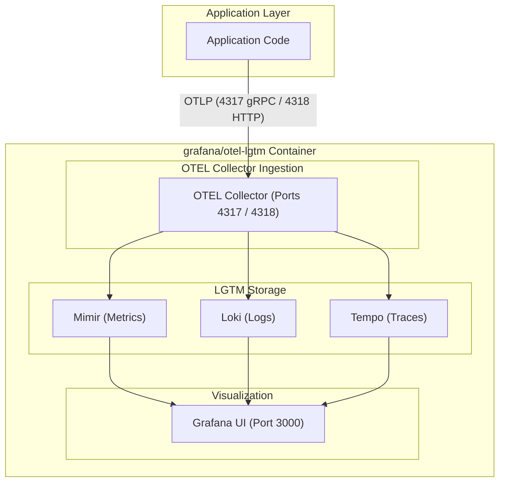

# NATS Observability Setup & Local Testing Guide

This guide details how to run a local observability stack using Grafana's OpenTelemetry LGTM container (`grafana/otel-lgtm`), configure NATS applications to emit telemetry, and verify metrics, traces, and logs in Grafana.

---

## 1. Overview of `grafana/otel-lgtm`

The `grafana/otel-lgtm` docker image is an all-in-one local testing container that packages:
- **OpenTelemetry Collector**: Listens on standard OTLP ports (`4317` gRPC and `4318` HTTP) to receive metrics, traces, and logs from application SDKs.
- **Mimir / Prometheus**: Ingests and stores metrics.
- **Tempo**: Ingests and stores distributed traces.
- **Loki**: Ingests and stores log streams.
- **Grafana UI**: Pre-configured visualization dashboard accessible on port `3000`.

Using `grafana/otel-lgtm` allows developers to test context propagation, trace waterfalls, and log correlation locally using a single container without configuring separate database backends.



---

## 2. Local Setup Options

Developers usually have a NATS server or cluster already running locally (mapped to port `4222` and monitoring port `8222`). You can run `grafana/otel-lgtm` alongside your existing environment using either option below.

### Option A: Direct Podman / Docker Command

Run the `grafana/otel-lgtm` container directly using Podman or Docker CLI:

```bash
# Run LGTM container mapping Grafana UI (3000) and OTLP ports (4317/4318)
podman run -d --name lgtm \
  -p 3000:3000 \
  -p 4317:4317 \
  -p 4318:4318 \
  grafana/otel-lgtm:latest
```

---

### Option B: Add to Existing `docker-compose.yaml`

Add the `lgtm` service block to your existing `docker-compose.yaml` file:

```yaml
version: '3.8'

services:
  # Add LGTM container to your existing compose file
  lgtm:
    image: grafana/otel-lgtm:latest
    container_name: local-lgtm
    ports:
      - "3000:3000" # Grafana UI
      - "4317:4317" # OTLP gRPC Ingestion Port
      - "4318:4318" # OTLP HTTP Ingestion Port
```

Start or update your compose services:

```bash
# Update running compose services
podman-compose up -d

# Verify container execution status
podman ps
```

---

## 3. Application Environment Configuration

Configure your publisher and subscriber applications to target the local LGTM container:

```bash
# Set OTLP Collector Endpoint (gRPC on port 4317)
export OTEL_EXPORTER_OTLP_ENDPOINT="http://localhost:4317"

# Service Metadata
export OTEL_SERVICE_NAME="order-processing-service"
export OTEL_SERVICE_VERSION="1.0.0"

# W3C Context Propagator
export OTEL_PROPAGATORS="tracecontext,baggage"
```

---

## 4. Where to Check Metrics, Traces, and Logs in Grafana

Access the Grafana UI at **`http://localhost:3000`** (Default Credentials: `admin` / `admin`).

Navigate to **Explore** (compass icon on the left sidebar) to inspect telemetry data:

### 4.1 Checking Metrics (Prometheus / Mimir)

1. Open **Explore** -> Select Data Source: **`Prometheus`**.
2. **Metrics Query Examples**:
   - Query application metrics (e.g. `nats_messages_published_total` or `http_requests_total`).
   - Query runtime memory or garbage collection stats (`go_memstats_alloc_bytes`).
3. Click **Run Query** to view metric graphs and rate histograms.

---

### 4.2 Checking Distributed Traces (Tempo)

1. Open **Explore** -> Select Data Source: **`Tempo`**.
2. Select the **Search** tab.
3. Filter by Service Name: Select your `OTEL_SERVICE_NAME` (e.g. `order-processing-service`).
4. Click **Run Query** to list matching trace spans.
5. Select a Trace ID from the result list to view the **Trace Waterfall**:
   - Verify the publisher span (`SpanKindProducer`).
   - Verify the consumer span (`SpanKindConsumer`).
   - Confirm W3C `traceparent` context propagation links publisher and subscriber spans into a single waterfall timeline.

---

### 4.3 Checking Logs (Loki)

1. Open **Explore** -> Select Data Source: **`Loki`**.
2. **Log Query Examples**:
   - Filter logs by service name: `{service_name="order-processing-service"}`.
   - Filter log messages containing errors: `{service_name="order-processing-service"} |= "error"`.
3. Click **Run Query** to view structured log outputs.

---

### 4.4 Trace to Log Correlation

1. When viewing log records in Loki, expand a log entry line.
2. Look for the `trace_id` label attached to the log record.
3. Click the **Tempo / Trace** button next to the `trace_id` label to open the trace waterfall for that log entry in a split-screen view.

---

## 5. Deployment & Production Onboarding Steps

When transitioning from local testing to staging/production environments:

1. **Update OTLP Collector Endpoint**: Change `OTEL_EXPORTER_OTLP_ENDPOINT` to point to the enterprise OpenTelemetry Collector DaemonSet or gateway service (e.g. `http://otel-collector.monitoring.svc:4317`).
2. **SRE / Platform Team Coordination**:
   - Confirm that the platform team's collector scrapes NATS Server monitoring port `8222` (`/varz`, `/jsz`, `/connz`, `/subsz`, `/routez`, `/raftz`).
   - Verify trace sampling rules and security scrubbing filters.
3. **Validation**: Execute synthetic test transactions and verify trace waterfalls and log correlations in the enterprise observability dashboard.
