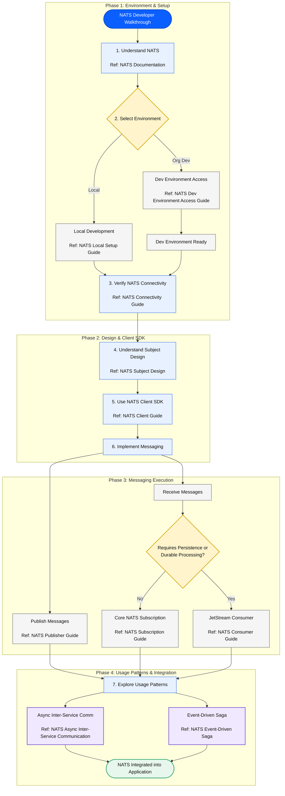

---

## Guide Index & Reference Matrix

| Step | Document Brief / Purpose | Document Link |
| :--- | :--- | :--- |
| **1. Understand NATS** | Overview of NATS concepts, messaging models, subjects, streams, and JetStream consumers. | [docs/developer-guide/index.md](file:///Users/mulukahemanthkumar/Documents/dev/poc/NATS/demo-1/docs/developer-guide/index.md) |
| **2. Development Environment** | Setup instructions for local NATS testing and organization dev environment access procedures. | [docs/developer-guide/local-setup.md](file:///Users/mulukahemanthkumar/Documents/dev/poc/NATS/demo-1/docs/developer-guide/local-setup.md) |
| **3. Verify NATS Connectivity** | Protocol connectivity validation, DNS resolution, CLI commands, and network troubleshooting. | [docs/nats-connectivity-guide.md](file:///Users/mulukahemanthkumar/Documents/dev/poc/NATS/demo-1/docs/nats-connectivity-guide.md) |
| **4. Understand Subject Design** | Subject naming hierarchy (`<domain>.<entity>.<action>`), validation rules, and wildcard matching semantics. | [docs/subject-design.md](file:///Users/mulukahemanthkumar/Documents/dev/poc/NATS/demo-1/docs/subject-design.md) |
| **5. NATS Client SDK** | Connection initialization, cluster failover, lifecycle handlers, liveness options, and JetStream API context. | [docs/developer-guide/client-guide.md](file:///Users/mulukahemanthkumar/Documents/dev/poc/NATS/demo-1/docs/developer-guide/client-guide.md) |
| **6. Publish Messages** | Core NATS publishing, JetStream persistent publishing, headers, deduplication, and publish expectations (OCC). | [docs/nats-publisher-guide.md](file:///Users/mulukahemanthkumar/Documents/dev/poc/NATS/demo-1/docs/nats-publisher-guide.md) |
| **6. Core NATS Subscription** | Ephemeral pub/sub subscriptions, async callbacks, sync pull loops, queue group worker pools, and draining. | [docs/nats-subscription-guide.md](file:///Users/mulukahemanthkumar/Documents/dev/poc/NATS/demo-1/docs/nats-subscription-guide.md) |
| **6. JetStream Consumer** | Persistent durable/ephemeral consumer CRUD, pull batching (`fetch`), ordered consumers, and ACK/NAK signals. | [docs/nats-consumer-guide.md](file:///Users/mulukahemanthkumar/Documents/dev/poc/NATS/demo-1/docs/nats-consumer-guide.md) |
| **7. Async Inter-Service Communication** | Architecture reference for replacing synchronous HTTP/gRPC calls with asynchronous NATS messaging patterns. | [docs/developer-guide/usage-patterns/inter-service-communcation.md](file:///Users/mulukahemanthkumar/Documents/dev/poc/NATS/demo-1/docs/developer-guide/usage-patterns/inter-service-communcation.md) |
| **7. Event-Driven Saga** | Distributed transaction coordination across microservices using event-driven saga orchestration over NATS. | [docs/developer-guide/usage-patterns/saga-pattern.md](file:///Users/mulukahemanthkumar/Documents/dev/poc/NATS/demo-1/docs/developer-guide/usage-patterns/saga-pattern.md) |
