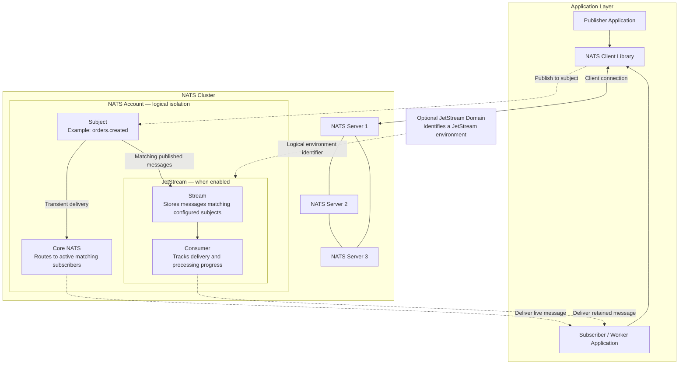

# NATS Overview

## 1. Overview

NATS is an open-source messaging platform that enables applications and microservices to exchange information without being tightly coupled to one another.

Applications connect to NATS using client libraries and publish messages to named destinations. NATS routes messages to interested applications, supporting event notifications, request-reply communication, and distributed work processing.

NATS provides two complementary messaging models:

- **Core NATS — Real-time messaging:** Delivers messages to active, matching subscribers. It provides at-most-once delivery and does not persist messages for later delivery.
- **JetStream — Persistent messaging:** Adds message storage, replay, acknowledgements, and consumer state, allowing applications to consume retained messages and recover processing progress.

The key distinction is that Core NATS decouples applications from each other, while JetStream also decouples them in time: publishers and consumers do not need to be online simultaneously.

**Explore further:** [What is NATS?](https://docs.nats.io/concepts/what-is-nats) · [Core NATS](https://docs.nats.io/nats-concepts/core-nats) · [JetStream](https://docs.nats.io/nats-concepts/jetstream)

## 2. Platform Capabilities

| Capability | What it enables | NATS concepts |
|---|---|---|
| Publish-subscribe messaging | Send information to interested applications without addressing each recipient directly. | Subjects, publishers, subscribers |
| Request-reply communication | Send a request and receive a response through messaging. | Request-reply, reply subjects, `_INBOX` |
| Load-balanced processing | Distribute messages among multiple service instances. | Queue groups; JetStream consumers for persistent processing |
| Persistent messaging | Retain messages for later consumption and support recovery after failures. | JetStream streams and consumers |
| Message replay | Reprocess retained messages or consume them from a selected position. | JetStream streams and consumers |
| Message routing and filtering | Organize messages by destination and subscribe to selected categories. | Subject hierarchies and wildcards |
| Application and resource isolation | Separate identities, permissions, and messaging resources. | Accounts, users, authorization |
| Distributed deployment | Run messaging across multiple servers and connect separate NATS environments. | Servers, clusters, gateways, leaf nodes |

**Explore further:**

- [Publish-subscribe](https://docs.nats.io/nats-concepts/core-nats/pubsub)
- [Request-reply](https://docs.nats.io/nats-concepts/core-nats/reqreply)
- [Queue groups](https://docs.nats.io/nats-concepts/core-nats/queue)
- [Subjects and wildcards](https://docs.nats.io/nats-concepts/subjects)
- [JetStream concepts](https://docs.nats.io/nats-concepts/jetstream)
- [Accounts and security](https://docs.nats.io/running-a-nats-service/configuration/securing_nats/accounts)
- [Clustering](https://docs.nats.io/running-a-nats-service/configuration/clustering)

## 3. Architecture

The diagram connects the application-facing messaging concepts to the NATS infrastructure and its logical resources. It distinguishes the server and cluster topology from account isolation and JetStream resources.

*Conceptual architecture; server placement, account boundaries, and the JetStream domain are simplified for readability. The diagram does not represent a specific production topology or replication assignment.*

**Explore further:** [NATS concepts](https://docs.nats.io/nats-concepts/intro) · [Clustering](https://docs.nats.io/running-a-nats-service/configuration/clustering) · [JetStream](https://docs.nats.io/nats-concepts/jetstream) · [Accounts](https://docs.nats.io/running-a-nats-service/configuration/securing_nats/accounts)

## 4. Terminology

This glossary explains NATS concepts in the context of the architecture above and maps them to the closest concepts in Solace PubSub+ and Apache Kafka. The examples are illustrative. Similar terminology does not always imply equivalent behavior.

| NATS Term | Description | NATS Example | Solace PubSub+ Equivalent | Apache Kafka Equivalent |
|---|---|---|---|---|
| **Message** | A unit of information exchanged between applications. | An event containing `orderId` and `status`. | Message | Record or event |
| **Publisher** | An application component that sends messages. | An order service publishes to `orders.created`. | Publisher client | Producer |
| **Subscriber** | An application component that receives messages matching its subscription. | An analytics service subscribes to `orders.*`. | Subscriber client | Consumer |
| **Client** | The application-side library or connection used to communicate with the messaging platform. | A Go application using the NATS Go client. | Messaging API client | Kafka client |
| **Subject** | A named destination used to publish and route messages. Subject names can be hierarchical. | `orders.created` | Topic; both support hierarchical routing, but their syntax and semantics differ. | Topic is the closest general destination concept; Kafka topics are persistent, partitioned logs rather than per-message routing subjects. |
| **Subscription** | An expression of interest in messages matching a subject or subject pattern. | Subscribe to `orders.*`. | Topic subscription | Consumer subscription to one or more topics; topic-level filtering is not identical to NATS subject matching. |
| **Wildcard** | A pattern character used to match multiple subjects. | `orders.*` matches one subject token after `orders`. | Topic subscription wildcards, with different syntax and matching rules | No direct equivalent to NATS subject wildcards; applications generally subscribe to topics and filter records separately. |
| **Request-reply** | A messaging pattern in which a requester sends a request and receives a response. | Request on `inventory.check`, response via `_INBOX`. | Request-reply messaging | Typically implemented with request and response topics, correlation identifiers, and application logic. |
| **Queue group** | A group of Core NATS subscribers among which each matching message is distributed to an eligible member. | Multiple `billing-worker` instances join the same queue group. | Shared subscription or competing consumers on a queue, depending on the required delivery model | Consumer group is the closest pattern, but Kafka assigns partitions to consumers rather than distributing each record through a broker-side queue-group mechanism. |
| **Core NATS** | The transient messaging capability that delivers to active matching subscribers without message persistence. | Publish a live notification to `orders.created`. | Direct messaging is the closest general comparison; exact delivery semantics depend on configuration. | No direct equivalent: Kafka topics retain records according to configured retention. |
| **JetStream** | The NATS persistence and streaming capability, providing stored messages, replay, and consumer state. | Store order events and process them later. | Guaranteed messaging and replay-related capabilities, depending on configuration; not a one-to-one equivalent. | Kafka's event-streaming and persistent topic model is the closest broad comparison. |
| **Stream** | A JetStream resource that stores messages matching configured subjects, subject to its retention and storage settings. | An `ORDERS` stream stores messages from `orders.>`. | No exact one-to-one equivalent; a durable queue or replay log may cover parts of the use case. | Topic is the closest general equivalent, but Kafka topics are partitioned logs with different consumption and retention semantics. |
| **Consumer** | A JetStream resource that tracks delivery progress for a stream and controls how messages are delivered and acknowledged. | A durable consumer processes retained order events. | A queue or durable subscription provides related capabilities, depending on the messaging model. | Consumer group and committed offsets provide related functionality; they are not the same resource abstraction. |
| **Acknowledgement** | A consumer response indicating that a message has been processed or handled according to the configured delivery model. | A JetStream consumer acknowledges a processed message. | Message acknowledgement for guaranteed delivery | Offset commits track consumption progress; they are not identical to per-message JetStream acknowledgements. |
| **Key-Value store** | A JetStream abstraction for storing and retrieving values by key, backed by JetStream streams. | A bucket stores the latest status for an order. | No direct equivalent assumed; compare with the specific caching or state-management service in use. | No direct equivalent in Kafka's core messaging model; additional state stores or services may be used. |
| **Object Store** | A JetStream abstraction for storing and retrieving objects using NATS. | Store and retrieve an object associated with a business process. | No direct equivalent assumed; evaluate the specific storage product or integration. | No direct equivalent in Kafka's core messaging model; external object storage is commonly used for large objects. |
| **Account** | A logical isolation boundary for identities, permissions, subjects, and resources. Cross-account communication can be explicitly configured. | An `orders` account and a separate `payments` account. | Message VPN is the closest isolation concept, separating clients and topic spaces. | No direct equivalent; isolation is typically implemented using cluster boundaries, topic-level permissions, and ACLs. |
| **User and permissions** | A user or other configured identity connects to NATS and is authorized to perform permitted operations. | A service identity can publish to `orders.created` but cannot subscribe to restricted subjects. | Client identity and access control within a Message VPN | Client identity, authentication, and topic-level ACLs |
| **NATS server** | A server process that accepts client connections, routes messages, and can host JetStream resources when enabled. | One `nats-server` process. | Event Broker | Kafka broker |
| **Cluster** | A group of NATS servers working together as a connected messaging environment. JetStream resources can be replicated when configured. | Three NATS servers form a cluster. | Event Broker deployment or broker group, depending on topology | Kafka cluster comprising brokers |
| **JetStream domain** | An optional identifier for a JetStream environment, useful when distinguishing connected JetStream environments. It is not a server or account. | A client accesses a configured JetStream domain. | No direct equivalent; compare with an explicitly configured messaging environment or domain. | No direct equivalent; a separate Kafka cluster is a distinct deployment, not a JetStream-style domain. |
| **Gateway** | Connects NATS clusters to support communication across separate NATS environments. | Two NATS clusters connected through gateways. | Inter-broker or Message VPN bridging mechanisms, depending on topology | Cross-cluster replication or linking mechanisms, depending on the Kafka distribution |
| **Leaf node** | Connects a NATS server or cluster to another NATS environment, commonly supporting edge or regional connectivity. | A regional NATS deployment connects to a central deployment through a leaf node. | No exact equivalent; broker bridging or federation may address related connectivity requirements. | No direct equivalent in Kafka's core architecture; cross-cluster replication or other integration mechanisms may be used. |

**Explore further — NATS**
- [Messages, subjects, and subscriptions](https://docs.nats.io/nats-concepts/subjects)
- [Core NATS](https://docs.nats.io/nats-concepts/core-nats)
- [JetStream streams and consumers](https://docs.nats.io/nats-concepts/jetstream)
- [Accounts and security](https://docs.nats.io/running-a-nats-service/configuration/securing_nats/accounts)
- [Cluster configuration](https://docs.nats.io/running-a-nats-service/configuration/clustering)
- [Gateways](https://docs.nats.io/running-a-nats-service/configuration/gateways)
- [Leaf nodes](https://docs.nats.io/running-a-nats-service/configuration/leafnodes)

## Next Steps

Choose the next guide based on what you want to accomplish.

### Get Started with Development
Set up a development environment, connect an application, and start exchanging messages.

- NATS Local Setup Guide
- Request for Dev Environment Access
- NATS Connectivity Guide
- Client Guide – SDK Usage
- Publisher Guide
- Subscription Guide
- Consumer Guide

### Design Messaging Solutions
Explore platform solution patterns and design guidance provided by the Platform Solutions Team to help teams build NATS-based applications and integrations.

- NATS Platform Architecture
- Subject Design
- Usage Pattern Guide
- Message Envelope and Schema Management

### Deploy and Manage NATS
Understand the deployment architecture, cluster topology, and lifecycle management of NATS infrastructure and resources.

- Deployment Architecture
- Managing NATS Clusters
- Cluster and Account Management Guide
- Stream Management Guidelines

### Security Architecture and Configuration
Understand the NATS security architecture, security controls, and the guides required to configure and manage secure platform access.

- Security Guide
- Identity & Access Guide
- Connectivity Guide

### Observe, Operate and Troubleshoot NATS
Understand how NATS is monitored, how platform health is assessed, and how to investigate operational issues across the messaging infrastructure.

- Observability Architecture
- Observability Guide
- Managing NATS Clusters
- Stream Management Guidelines

Use these guides for detailed architecture, implementation instructions, organizational standards, and operational procedures.